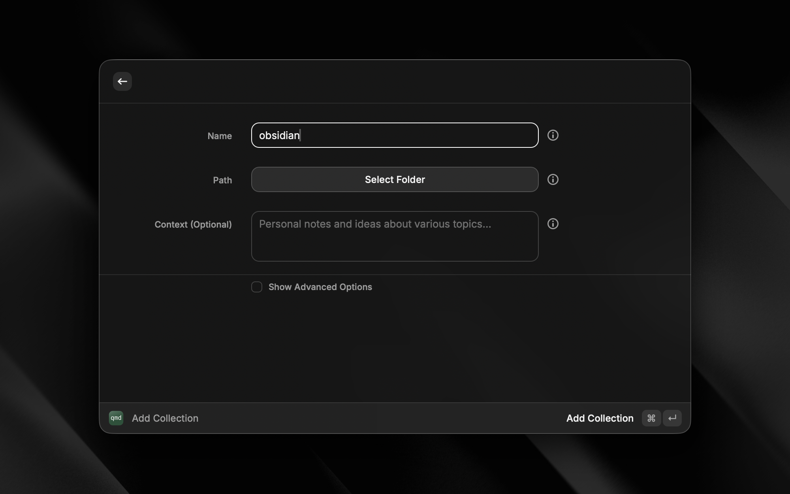
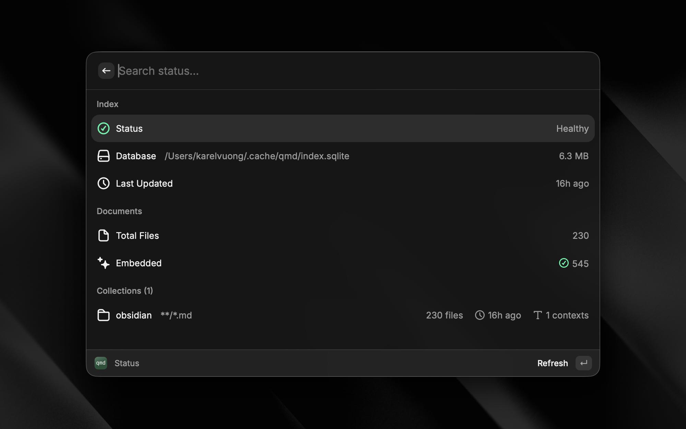

# QMD for Raycast

A Raycast extension for [QMD](https://github.com/tobi/qmd) - an on-device search engine for markdown files.

## Screenshots

## Prerequisites

1. **Bun**: Install from [bun.sh](https://bun.sh)
2. **QMD**: `bun install -g https://github.com/tobi/qmd`
3. **SQLite** (macOS): `brew install sqlite`

## Getting Started

1. Add a collection: point QMD at a folder of markdown files
2. Generate embeddings: enables semantic search (downloads ~3GB model)
3. Search: keyword, semantic, or hybrid search

See [QMD documentation](https://github.com/tobi/qmd) for full details on commands and features.

## Data

- Index: `~/.cache/qmd/index.sqlite`
- Config: `~/.config/qmd/index.yml`
